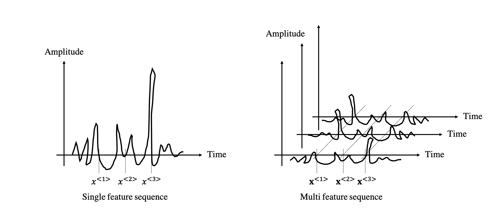
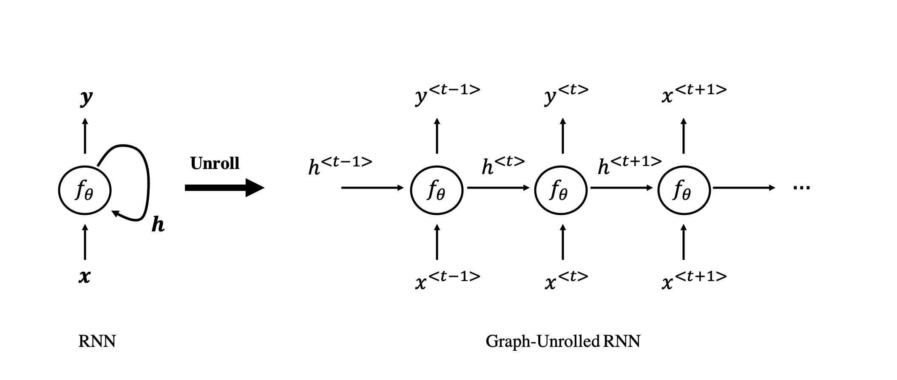

# Sequence modelling
In this lecture we will start investigating a family of Neural Network that are particularly suitable for learning tasks that involve sequences
as input data.

To understand what a sequence is in the context of Deep learning, let's consider a recording over time (e.g., an audio recording):

Compared to other dataset types (e.g., tabular or gridded data), the different samples of a sequence present an obvious degree of correlation
that tends to diminuish the further away to samples are from each other. Moreover, in the case of multi-feature sequences (e.g., multi-component
seismological recordings), the overall sequence contains a number of features at each time step that can be more or less correlated to each other.

Sequences appear in every aspect of life. For example, outside of geoscience, the two most commonly used data in sequence modelling are:

- text
- audio

More specifically, as we will see, the field of Natural Language Processing (NPL) has experienced a revolutionary growth in the last decade thanks
to sequence modelling and deep learning. In geoscience, many of the commonly used datasets can also be interpreted as sequences, for example:

- seismograms
- well logs
- production data

are all datatypes that present a certain degree of correlation along either the time or depth axis. 

Finally, similar to FFNs or CNNs, sequence modelling can be used for various applications:

- Single output classification: given an input sequence of a certain lenght $\mathbf{x}$, a model is trained to decide whether than sequence contains
  a feature of interest or not. For example, given a seismogram we may be interest to detect the presence of a seismic event, or we may want to find out
  if a well log is clean or corrupted by some recording error or what is the facies in the middle of the sequence;
- Multi ouput classification (i.e., semantic segmentation): given an input sequence of a certain lenght $\mathbf{x}$, a model is trained to classify each element
  of the input sequence into a predefined set of classes. Taking once again the example of facies labelling, here the task is extended to predicting labels
  at each depth level (and not only in the middle of the sequence);
- Regression: given an input sequence of a certain lenght $\mathbf{x}$, a model is trained to predict a continuous output, which could be
  a single value $y$ or a sequence of values $\mathbf{y}$ that has the same (or different lenght) of the input. For example, given a set of 
  well logs we may want to predict another one that was not acquired. Similarly, given a seismic trace recorded by the vertical component of a geophone
  we may be interested to predict the horizontal components. Both of these example fall under the area of *domain translation*;

## Motivation
Let's start by considering what we have learned so far and discuss how we could use those tools to handle sequential data. First of all,
we consider a sequence of $N_\tau$ samples and $N_f$ features:

$$
\mathbf{X} = \begin{bmatrix} 
                x_1^{<1>} & x_1^{<2>} & x_1^{N_\tau} \\
                ...     & ...     & ... \\
                x_{N_f}^{1} & x_1^{<2>} & x_{N_f}^{N_\tau}
  \end{bmatrix} =
  \begin{bmatrix} 
                \mathbf{x}^{<1>} & \mathbf{x}^{<2>} & \mathbf{x}^{<N_\tau>}
  \end{bmatrix}_{[N_f \times N_\tau]}
$$

we could easily deal with this as if it was a 2D-array (i.e., an image) and use CNNs. However, the locality argument used for the convolutional filters
that constitute a convolutional layer would not make much sense here, especially if we know that elements in the sequence away from each other may still have
a certain degree of correlation. Alternatively, the matrix $\mathbf{X}$ could be simply vectorized and used as input to a FFN. This approach does 
however present two main limitations:

- since the vector $vec(\mathbf{X})$ is likely to be very long, weight matrices will be very large leading to a very expensive training process;
- FFNs cannot easily handle inputs of variable lenghts, so all sequences will need to have fixed lenght. We will see that being able to handle 
  variable-lenght sequences is very useful in some situations. 
  
Both problems can be overcome by taking advantage of *parameter sharing*. We have already introduced this concept in the context of CNNs,
where the same filters are used in different parts of the input. Similarly in sequence modelling, the idea of parameter sharing allows using the same
parameters at different stages of the sequence and therefore allows the network to easily handle sequences of variable lenght. By doing so,
a new type of neural network is created under the name of Recurrent Neural Network (RNN):

where $\mathbf{x}$ is the input vector (or matrix when multiple features are present), $\mathbf{y}$ is the output vector, and $\mathbf{h}$
is the so calle hidden state vector.

As clearly shown in the unrolled version of the network into a standard computational graph, various inputs and hidden states are passed through
the same function $f_\theta$ with a given number of training parameters. This is very different from a feed-forward network where different functions 
is are used over consecutive layers. The choice of the function $f_\theta$ leads to the definition of different RNN architectures. 

Before we begin introducing a number of popular architectures for sequence modelling, let's introduce some useful notation. Inputs and outputs of a RNNs
will be always defined as follows:

$$
\mathbf{X} = \begin{bmatrix} 
                \mathbf{x}^{<1>} & \mathbf{x}^{<2>} & \mathbf{x}^{<T_x>}
  \end{bmatrix}_{[N_f \times T_x]}
$$

and

$$
\mathbf{Y} = \begin{bmatrix} 
                \mathbf{y}^{<1>} & \mathbf{y}^{<2>} & \mathbf{y}^{<T_y>}
  \end{bmatrix}_{[N_t \times T_y]}
$$

where $T_x$ and $T_y$ are the lenght of the input and output sequences. Finally, note that in the most general case these parameters 
may be sample dependant (i.e., when we allow sequences of variable size): the following notation will be used in that case, $T_x^{(i)}$ and $T_y^{(i)}$
where $i$ refers to the i-th training sample. Moreover, given that we recurrently apply the same function $f_\theta$, we can very compactly write an
RNN as:

$$
h^{<t>}, y^{<t>}=f_\theta(h^{<t-1>}, x^{<t>}) \qquad t=1,2,T_x
$$

that we can unroll into:

$$
h^{<t>}, y^{<t>}=f_\theta(f_\theta(f_\theta(h^{<0>}, x^{<1>}), ...), x^{<t-2>}), x^{<t-1>}), x^{<t>}) 
$$

As we have already briefly mentioned, RNNs allows some flexibility on the choice of $T_y$ (i.e., the length of the output sequence).
This leads to the creation of different network architectures that are suitable to different tasks:

Note that in the cases 3 and 4, the predicted output is fed back to the network as input to the next step at inference stage as shown in the figure above. 
At training stage, however, the true output is used as input.

In summary, what we wish to achieve here is to create a network that can learn but short and long term relationships in the data such that
both samples closes to each other as well as far away samples can help in the prediction of the current step. By using parameter sharing in a smart way,
we can avoid overparametrizing the network and therefore limit the risk of overfitting on short and long term trends in the data. In other words,
by assuming stationariety in the data, we let the network understand if step $t$ and $t+N_t$ are correlated to each other across the entire time sequence,
instead of giving the network with the freedom to find relationships between any two samples in the sequence.

## Basic RNN
It is now time to discuss in more details what is an effective function, $f_\theta$.