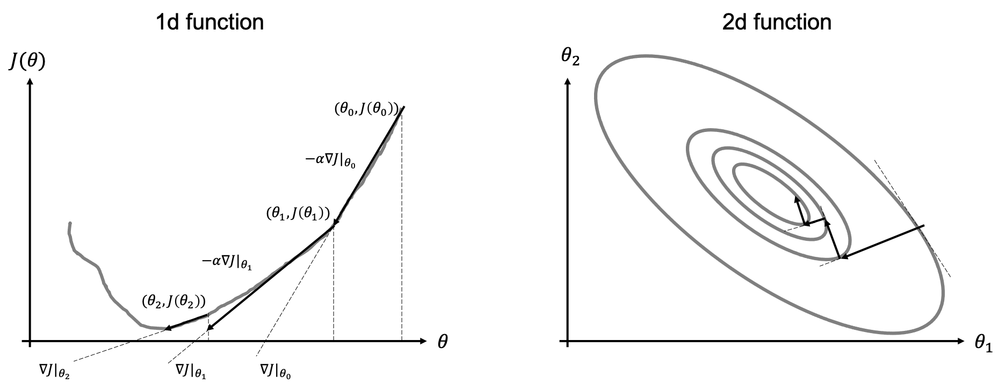

# Gradient-based optimization
After reviewing some of the basic concepts of linear algebra that we will be using during this course, we are now in a position
to start our journey in the field of *learning algorithms*. Any learning algorithm, no matter its level of complexity, is 
composed of 4 key elements:

**Dataset**: a collection of many examples (sometimes referred to as samples of data points) that represents the experience
we wish our machine learning algorithm to learn from. More speficically, the dataset is defined as:
$$
\mathbf{x} = [x_1, x_2, ..., x_{N_f}]^T \quad \mathbf{X} = [\mathbf{x}^{(1)}, \mathbf{x}^{(2)}, ..., \mathbf{x}^{(N_s)}] 
$$
and
$$
\mathbf{y} = [y_1, y_2, ..., y_{N_t}]^T \quad \mathbf{Y} = [\mathbf{y}^{(1)}, \mathbf{y}^{(2)}, ..., \mathbf{y}^{(N_s)}] 
$$
where $N_f$ and $N_t$ are the number of features and targets for each sample in the dataset, respectively, and 
$N_s$ is the number of samples.

**Model**: a mathematical relation between the input (or features) and output (or target) 
or our dataset. It is generally parametrized as function $f$ of a number of free parameters $\theta$ which we want the 
learning algorithm to estimate given a task and a measure of performance, and we write it as 
$$
\mathbf{y} = f_\theta(\mathbf{x})
$$

**Loss (and cost) function**: quantitative measure of the performance of the learning algorithm, which we wish to minimize 
(or maximize) in order to make accurate predictions on unseen data. It is written as
$$
J = \sum_{i=1}^{N_s}  \mathscr{L} (\mathbf{y}^{(i)}, f(\mathbf{x}^{(i)}))
$$

where $\mathscr{L}$ is the loss function for each input-output pair and $J$ is the overall cost function.

**Optimization algorithm**: mathematical method that modifies the aims to drive down (up) the cost function by modifying
its free-parameters $\theta$:
$$
\hat{\theta} = \underset{\theta} {\mathrm{argmin}} J
$$

Optimization algorithms are generally divided into two main families: gradient-based 
(or local) and gradient-free (or global). Gradient-based optimization is by far the most popular way to train NNs and 
will be discussed in more details below.

## Gradient- and steepest-descent algorithms
The simplest of gradient-based methods is the so-called *gradient-descent* algorithm. As the name implies, 
this algorithm uses local gradient information of the functional to minimize/maximize to move towards its global 
mimimum/maximum as depicted in the figure below.

More formally, given a functional $f_\theta$ and its gradient $\nabla f = \frac{\delta f}{\delta \theta}$, 
the (minimization) algorithm can be written as:

Initialization: choose $\theta \in \mathbb{R}$

For $i=0,...N-1$;

1. Compute update direction $d_i = -\nabla f |_{\theta_i}$
2. Estimate step-lenght $\alpha_i$
3. Update $\theta_{i+1} = \theta_{i} + \alpha_i d_i$

Note that the maximization version of this algorithm simply switches the sign in the update direction (first equation of the algorithm).
Moreover, the proposed algorithm can be easily extended to N-dimensional model vectors $\theta=[\theta_1, \theta_2, ..., \theta_N]$ by
defining the following gradient vector 
$\nabla f=[\delta f / \delta\theta_1, \delta f / \delta\theta_2, ..., \delta f/ \delta\theta_N]$.

### Step lenght selection
The choice of the step-lenght has tremendous impact on the performance of the algorithm and its ability to converge 
fast (i.e., in a small number of iterations) to the optimal solution.

The most used selection rules are:

- Constant: the step size is fixed to a constant value $\alpha_i=\hat{\alpha}$. This is the most common situation that we
  will encounter when training neural networks. In practice, some adaptive schemes based on the evolution of the train
  (or validation) norm are generally adopted, but we will still refer to this case as costant step size;
- Exact linesearch: at each iteration, $\alpha_i$ is chosen such that it minimizes $f(\theta_{i} + \alpha_i d_i)$. This
  is the most commonly used approach when dealing with linear systems of equations.
- Backtracking  "Armijo" linesearch: each each iteration, given a parameter $\mu \in (0,1)$, start with $\alpha_i=1$ 
  and reduce it by a factor of 2 until the following condition is satisfied: $f(\theta_i) - f(\theta_{i} + \alpha_i d_i) \ge  -\mu \alpha_i \nabla f^T d_i$
  
## Second-order optimization
Up until now we have discussed first-order optimization techniques that rely on the ability to evaluate the function $f$ and 
its gradient $\nabla f$. Second-order optimization method go one step beyond in that they use information from both the 
local slope and curvature of the function f. 

When a function has small curvature, the function and its tangent line are very similar: 
the gradient alone is therefore able to provide a good local approximation of the function (i.e., $f(\theta+\delta \theta)\approx f(\theta) + \nabla f \delta \theta$).
On the other hand, if the curvature of the function of large, the function and its tangent line start to differ very quickly away from
the linearization point. The gradient alone is not able anymore to provide a good local approximation of the function 
(i.e., $f(\theta+\delta \theta)\approx f(\theta) + \nabla f \delta \theta + \nabla^2 f \delta \theta^2$).

In order to be able to discuss second-order optimization algorithm, let's first introduce the notion of *Jacobian*:

**FINISH...**

Finally, I encourage everyone to read the following [blog post](https://ruder.io/optimizing-gradient-descent/) for a more
detailed overview of the optimization algorithms discussed here. Note that we will also look more into some of the recent 
optimization algorithms that overcome some of the limitations of standard SGD in [this lecture](lectures/10_gradopt1.md).

