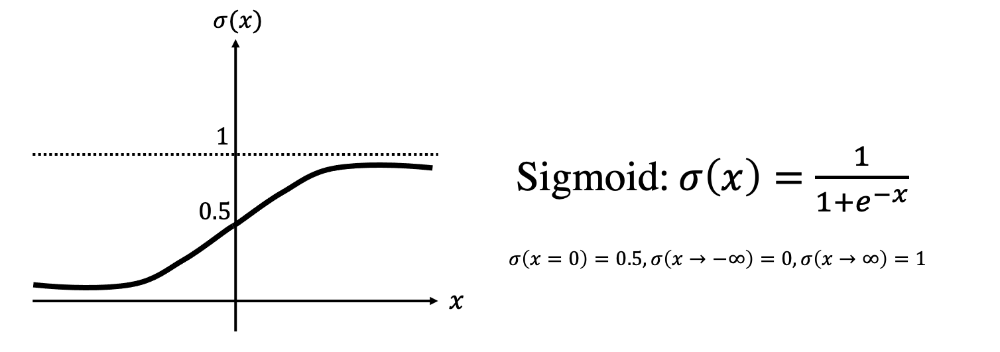
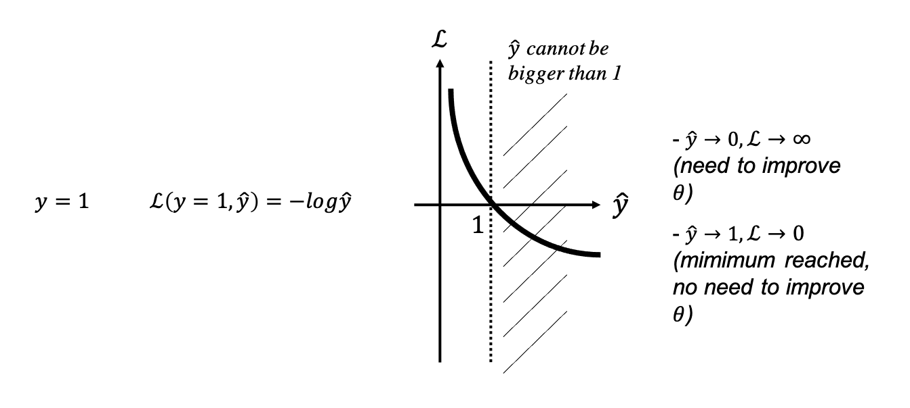
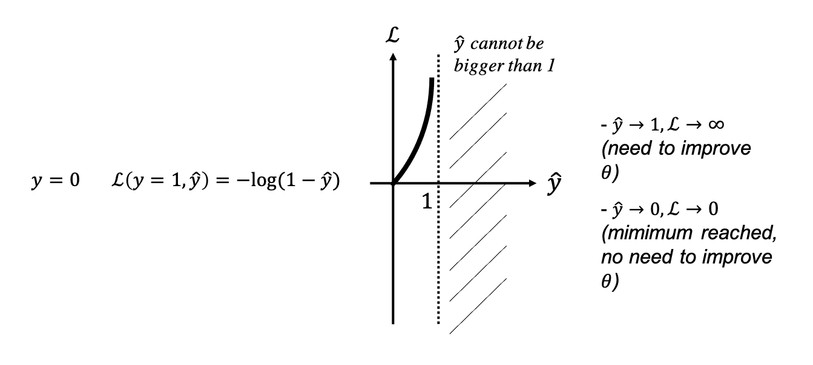
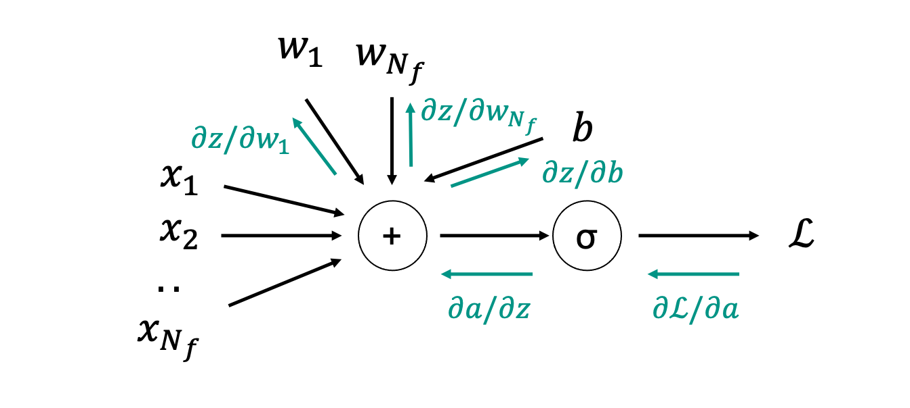

# Linear and Logistic Regression

In the previous lecture we have learned how to optimize a generic loss function $J_\theta$ 
by modifying its free parameters $\theta$. Whilst this is a very generic framework that can be used for 
various applications in different scientific field, from now on we will learn how to take advtange of
similar algorithms in the context of Machine Learning.

## Linear regression
In preparation to our lecture on Neural Networks, we consider here what is generally referred to as the simplest
machine learning model for regression, *linear regression*. Its simplicity lies in the fact that we will only consider 
a linear relationship between our inputs and targets:

where $\textbf{x}$ is a training sample with $N_f$ features, $\textbf{w}$ is a vector of $N_f$ weights and $b=w_0$ is the
so-called bias term. The set of trainable parameters is therefore the combination of the weights and bias 
$\boldsymbol\theta=[\textbf{w}, b] \in \mathbb{R}^{N_f+1}$. Similarly the combination of the training sample and a 1-scalar is defined as 
$\tilde{\textbf{x}}=[\textbf{x}, 1] \in \mathbb{R}^{N_f+1}$
The prediction $\hat{y}$ is simply obtained by linearly 
combining the different features of the input vector and adding the bias.

Despite its simplicity, linear regression (and more commonly multi-variate linear regression) has been succesfully used in 
a variety of geoscientific tasks, examples of such a kind are:

- rock-physics models, where a number of petrophysical parameters (e.g., porosity, shale content, depth) can be linearly regressed 
  in order to predict an elastic parameter of interest (e.g., dry bulk modulus);
  
- time-to-depth conversion, where a velocity (or depth) prediction is generally made as a linear combination of two-way traveltime
  and other parameters such as seismic amplitudes and various derived attributes;
  
- filling gaps in petrophysical well logs, where various petrophysical measurements (e.g., GR, NEU, DEN) are regressed to 
  estimate another quantity of interest (e.g., S-wave velocity of DTS) that is not directly available within a certain depth interval.

Assuming availability of $N_s$ training samples, the input training matrix and output training vector of a linear regression 
model is written as:

$$
\mathbf{X}_{train} = [\tilde{\mathbf{x}}^{(1)}, \tilde{\mathbf{x}}^{(2)}, ..., \tilde{\mathbf{x}}^{(N_s)}] \in \mathbb{R}^{N_f+1 \times N_s}, \quad
\mathbf{y}_{train} = [y^{(1)}, y^{(2)}, y^{(N_s)}] \in \mathbb{R}^{N_s \times 1}
$$

Finally, the **model** can be compactly written as:

$$
\hat{\textbf{y}}_{train} = \textbf{X}_{train}^T \boldsymbol\theta
$$

Next, we need to define a metric (i.e., cost function) which we can use to optimize for the free parameters $\boldsymbol\theta$.
For regression problems, a common metric of goodness is the L2 norm or MSE (Mean Square Error):

$$
J_\theta = MSE(\textbf{y}_{train}, \hat{\textbf{y}}_{train}) = \frac{1}{N_s} || \textbf{y}_{train} - \hat{\textbf{y}}_{train}||_2^2 = 
\frac{1}{N_s} \sum_i^{N_s} (y_{train}^{(i)}-\hat{y}_{train}^{(i)})^2
$$

Based on our previous lecture on optimization, we need to find the best set of coefficients $\theta$ that minimize the MSE:

$$
\hat{\theta} = min_\theta  J_\theta \rightarrow \theta_{i+1} = \theta_i - \alpha \nabla J_\theta
$$

However, since this is a linear inverse problem we can write the analytical solution of the minimization problem as:

$$
\hat{\theta} = (\textbf{X}_{train}^T \textbf{X}_{train})^{-1} \textbf{X}_{train}^T \textbf{y}_{train}
$$

which can be obtained by inverting a $N_s \times N_s$ matrix. 

An important observation, which lies at the core of most Machine Learning algorithms, is that once the model is trained 
on the $N_s$ available input-target pairs, the estimated $\hat{\theta}$ coefficients can be used to make *inference* on any new unseen data:

$$
y_{test} = \tilde{\textbf{x}}^T_{test} \hat{\theta}
$$

To conclude, once a linear regression model has been trained, a variety of measures exist to assess the goodness of the model. Whilst the same 
metric used for training, the mean-square error, can be used to assess the model performance, other metrics are represented by the Pearson coefficient 
($R^2$) and the mean-absolute erorr (MAE).

## Logistic regression

Simply put, logistic regression is an extension of linear regression to the problem of binary classification. Whilst the model used
by logistic regression is the same linear model described above, this will be coupled with a nonlinear 'activation' function that enforces the
outcome of the entire model to be bounded between 0 and 1 (i.e., a probability). In other words, whilst the input training matrix is the same
as that of linear regression, the output training vector becomes:

$$
y_{train} = \{0, 1\}
$$

A variety of applications of such a simple model can be found in geoscience, one common example is represent by net pay prediction 
from petrophysical logs.

Given a single pair of training samples $\textbf{x}, y$, a mathematical **model** for logistic regression can be compactly written as:

$$
\hat{y} = f_\theta(\textbf{x}) = P(y=1 | \textbf{x}) \in (0,1)
$$

or in other words, the input vector $\textbf{x}$ is fed through a nonlinear model $f_\theta$ whose output is a scalar number between 0 and 1 that 
represents the probability of the target output to be 1.

Considering now a set of $N_s$ training pairs, the model can be explicitely written as:

$$
\hat{\textbf{y}}_{train} = f_\theta(\textbf{X}_{train}) = \sigma(\textbf{X}_{train}^T \boldsymbol\theta)
$$

where $\sigma$ is a sigmoid function as shown in figure below:

Once again, let's define a cost function that we can use to optimize the model parameters. For binary classification, a common metric of goodness
is represented by the so-called *binary cross-entropy*:

$$
\mathscr{L}(y_{train}^{(i)}, \hat{y}_{train}^{(i)}) = -(y_{train}^{(i)} log(\hat{y}_{train}^{(i)}) + 
(1-y_{train}^{(i)})) log(1- \hat{y}_{train}^{(i)}))
$$

and

$$
J_\theta = \frac{1}{N_s} \sum_i^{N_s} \mathscr{L}(y_{train}^{(i)}, \hat{y}_{train}^{(i)})
$$

Let's gain some intuition onto why this is a good cost function. More specifically, we consider with a drawing the two cases separately.
First the case of positive target, $y_{train}^{(i)}=1$ 

and then the case of negative target, $y_{train}^{(i)}=0$:

Our drawings cleary show the validity of such a cost function in both cases. The further away is the prediction from the true label the higher the
resulting cost function. Similar to the case of linear regression, we can now update the model parameters by minimizing the cost function:

$$
\hat{\theta} = min_\theta  J_\theta \rightarrow \theta_{i+1} = \theta_i - \alpha \nabla J_\theta
$$

However a major difference arises here. Whilst it is easy to compute the derivative of the MSE with respect to the model parameters $\theta$, and 
even more since the model is linear an analytical solution can be found (as shown above), this is not the case of the cost function of the logistic
regression model.

The good news here is that there exist a systematic approach to computing the derivative of a composite function (i.e., $f(x)=f_N(...f_2(f_1(x)))$), which
simply relies on the well-known *chain rule* of functional analysis. This method is referred to in the mathematical community as Automatic Differentiation (AD),
and more likely so as Back-propagation in the ML community. As this lies as the foundation of the training process for neural networks, we will get into details 
later in the text. At this point suffices to say that if we have a composite function like the one above, its derivative with respect to $x$ can be written as:

$$
\frac{\partial f}{\partial x} = \frac{\partial f_N}{\partial f_{N-1}} ... \frac{\partial f_2}{\partial f_1} \frac{\partial f_1}{\partial x}
$$

where the derivative is simply the product of a number of derivatives over the chain of operations of the composite function.
Note that in practice it is more common to compute this chain rule in reverse order, from left to right in the equation above.

Whilst we generally rely on the built-in functionalities of deep learning libraries such as Tensorflow or PyTorch to compute such derivaties, we will
perform here a full derivation for the simple case of logistic regression. In order to do so, we introduce a very useful mathamatical tool that we use to 
keep track of a chain of operations and later know how to evaluate the associated gradient. This tool is usually known as *computational graph*. More specifically,
instead of writing the entire logistic regression model compactely in a single equation, we divide it here into its atomic components:

$$
z = \textbf{x}^T \boldsymbol\theta, \quad
a = \sigma(z), \quad \mathscr{L} = -(y log(a) + (1-y)log(1-a))
$$

such that the derivative of the loss function with respect to the model parameters becomes:

$$
\frac{\partial \mathscr{L} }{\partial \boldsymbol\theta} = \frac{\partial \mathscr{L} }{\partial a}
\frac{\partial a }{\partial z} \frac{\partial z}{\partial \boldsymbol\theta}
$$

The forward and backward passes (as described in software frameworks like PyTorch) can be visually displayed as follows:

Let's start from $\partial \mathscr{L} / \partial a$:

$$
\frac{\partial \mathscr{L}}{\partial a} = -\frac{y}{a} + \frac{1-y}{1-a} = \frac{-y(1-a) + (1-y)a}{a (1-a)}
$$

and $\partial a / \partial z$:

$$
\frac{\partial a}{\partial z} = a(1-a)
$$

which we can combine together to obtain a simplified formula for the derivative of the loss function of the output of the weighted summation ($z$)

$$
\frac{\partial \mathscr{L}}{\partial z} = \frac{\partial \mathscr{L}}{\partial a} \frac{\partial a}{\partial \sigma} = 
-y(1-a) + (1-y)a = a - y = dz
$$

Finally we differentiate between the weights and the bias to obtain:

$$
\frac{\partial z}{\partial w_i} = x_i, \quad \frac{\partial z}{\partial b} = 1
$$

such that:

$$
\frac{\partial \mathscr{L}}{\partial w_i} = dz \cdot x_i = dw_i, \quad \frac{\partial \mathscr{L}}{\partial b} = dz = db
$$

Having found the gradients, we can now update the parameters as discussed above:

$$
w_i \leftarrow w_i - \alpha \frac{\partial \mathscr{L}}{\partial w_i} = w_i - \alpha dw_i, \quad
b \leftarrow b - \alpha \frac{\partial \mathscr{L}}{\partial b} = b - \alpha db
$$

which can be easily modified in the case of multiple training samples:

$$
w_i \leftarrow  w_i - \alpha \sum_{j=1}^{N_s} dw_i^{(j)}, \quad
b \leftarrow b - \alpha \sum_{j=1}^{N_s} db^{(j)}
$$

We can now summarize a single step of training for $N_s$ training samples for the logistic regression model:

$\textbf{z}=\textbf{X}_{train}^T \boldsymbol \theta$

$\textbf{a} = \sigma(\textbf{z})$

$\textbf{dz} = \textbf{a} - \textbf{y}$

$\textbf{dw} = \frac{1}{N_s} \textbf{X}_{train} \textbf{dz}$

$db = \frac{1}{N_s} \textbf{1}^T \textbf{dz}$

$\textbf{w} \leftarrow \textbf{w} - \alpha \textbf{dw}$

$b \leftarrow b - \alpha db$

To conclude, let's turn our attention into some of the *evaluation metrics* that are commonly used to assess the performance of a 
classification model (or classifier). Note that these metrics can be used for the logistic regression model discussed here as well as for
other more advanced models discussed later in the course. 

In general for binary classification we have two possible outcomes (positive/negative or true/false) for both the true labels $y$ and the 
predicted labels $\hat{y}$. We can therefore define 4 scenarios:

and a number of complementary metrics (all bounded between 0 and 1) can be defined. Note that no metric is better than the others, the importance of one metric over another is context dependant.

1. **Precision**: $Pr=\frac{TP}{TP+FP}$, percentage of correct positive predictions over the overall positive predictions. This measure is 
   appropriate when minimizing false positives is the focus. In the geoscientific context, 
   this may represent a meaningful metric for applications where the main interest is that of predicting the smallest possible number of false positives, 
   whilst at the same time accepting to miss out on some of positives (false negatives). This could be the case when we want to predict hydrocarbon bearing reservoirs from 
   seismic data, where we know already that we will not be able to drill wells into many of them. It is therefore important that even if we make very few
   positive predictions these must be accurate, whilst the cost of missing other opportunities is not so high. On the other hand, this measure is blind to the
   predictions of real positive cases to be chosen to be part of the negative class (false negative);
2. **Recall**: $Rc=\frac{TP}{TP+FN} = \frac{TP}{P}$, percentage of correct positive predictions over the overall positive occurrences. This measure is
   appropriate when minimizing false negatives is the focus. An opposite scenario to the one presented above is represented by the case of a classifier trained to predict pressure kicks whilst drilling a well. 
   In this case, we are not really concerned with making a few mistakes where we predict a kick when this is not likely to happen (False Positive); 
   of course, this may slow down the drilling process but it is nowhere near as dramatic as the case in which we do not predict a kick which is going to happen (False Negative); 
   a high recall is therefore what we want, as this is an indication of the fact that the model does not miss out on many positive cases. 
   Of course a model that always provides a positive prediction will have a recall of 1 (FN=0), indication of the fact that a high recall is not 
   always an indication of a good model;
3. **Accuracy**: $Ac=\frac{TP+TN}{TP+TN+FP+FN}=\frac{TP+TN}{P+N}$, percentage of correct predictions over the total number of cases. 
   This measure combines both error types (in the denominator), it is therefore a more global measure of the quality of the model.
4. **F1-Score**: $2 \frac{Pr \cdot Rc}{Pr+Rc}$, represents a way to combine precision and recall into a single measure that captures both properties.

Finally, a more complete description of the performance of a model is given by the so-called *confusion matrix*, which for the case of binary classification
is just the $2 \times 2$ table in the figure above. This table can be both unnormalized, where each cell simply contains the number of samples which satisfy
the specific combination of real and predicted labels, or normalized over either rows or columns.

