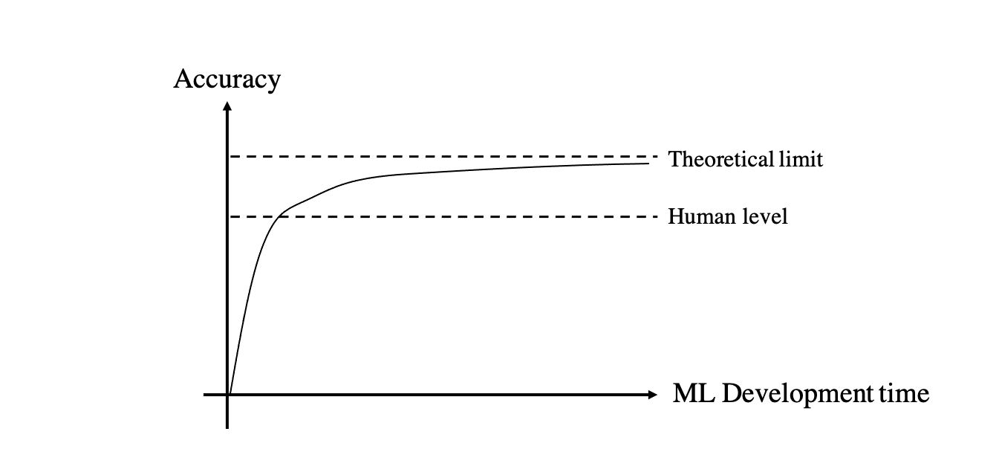
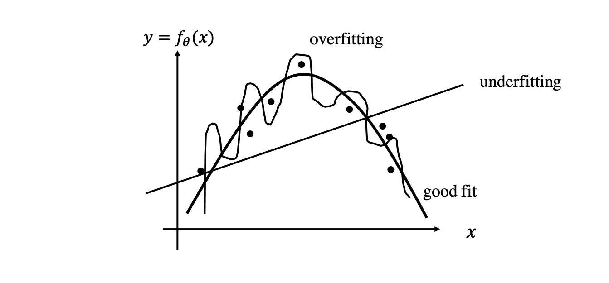
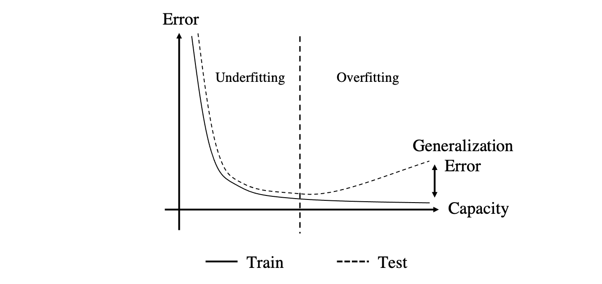
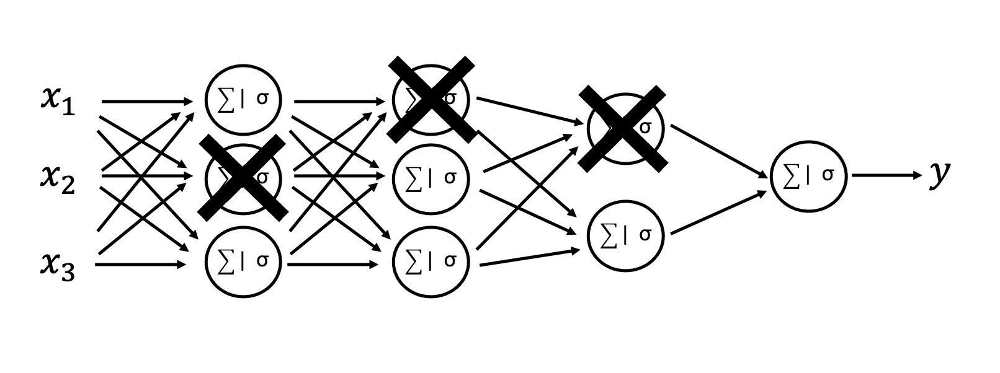
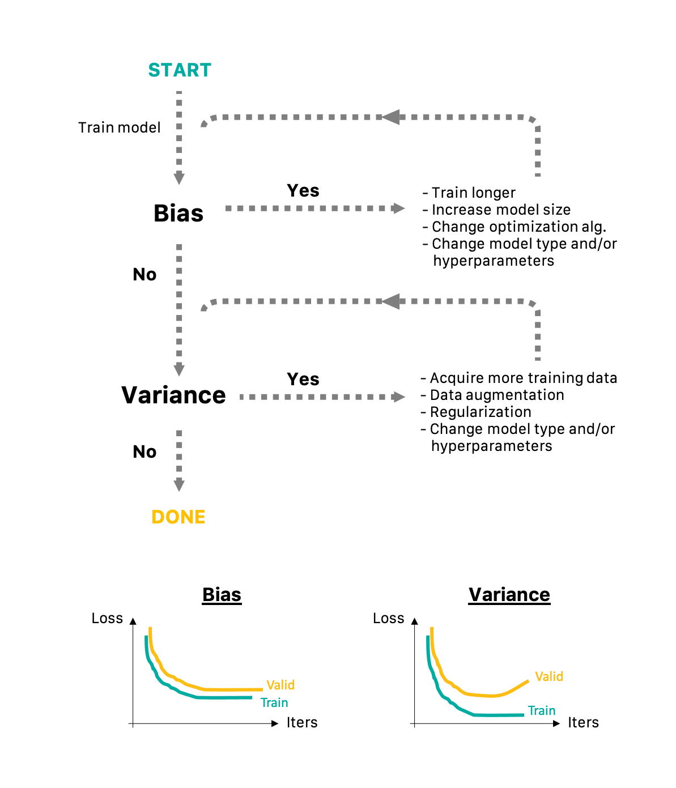

# Best practices in the training of Machine Learning models

This lecture is devoted to the training of Machine Learning models in general, with Neural Networks 
representing a subclass of the entire set of models commonly used to learn mappings between some
features and targets. As we will see in the following, a number of `best practices` are in fact 
indipedent on the model used.

Let's begin by re-stating here the overall aim of a ML model: a model is useful if it can perform
well on new, previously not seen data. This property of a model is also generally referred to as
*generalization*.

In order to be able to assess the generalization capabilities of a model, the dataset available for
training must be divided into 3 distinct sets:

- Training dataset: $\{ \mathbf{X}_{train}, \mathbf{Y}_{train} \}$, used to train the model 
  (e.g., learn the free-parameters $\boldsymbol \theta$ of a NN);
- Validation dataset: $\{ \mathbf{X}_{valid}, \mathbf{Y}_{valid} \}$, used to select the hyperparamters of
  the model;
- Testing dataset:$\{ \mathbf{X}_{test}, \mathbf{Y}_{test} \}$, used only once a model is finalized
  (trained and optimized) to produce an *unbiased* estimate of model performance.

Note that a number of assumptions are usually made on the training samples, namely each sample is
indipendent from the others, samples must come from the same distributions. The first assumption
is however seldom satisfied as a different training samples are related to each other to some degree (this is for example
the case when samples are taken from well logs at consecutive depth levels or from 2D slices of 3D seismic
cubes). On the other hand, the second assumption must be satisfied for a succesfull training. For example, if well logs
from the North Sea are used in the training data and well logs from Onshore US are used in the testing data,
any estimate of model performance will be biased as the two sets are likely to belong to different distributions.

Historically, the overall dataset is split into training/validation/testing data with the following proportions: 
60%/20%/20%. This is the case for small datasets in the order of hundreds or thousands samples to be able to
retain a large enough set to produce reliable statistics. In recent years, when training neural networks with 
large datasets (in the order of millions or more samples), the split is more commonly chosen as
98%/1%/1%. As the size of datasets in geoscientific applications is usually in between what we referred to as small
and large datasets, choosing validation and training sets that are 5%/10% of the overall dataset is
usually a good choice.

A measure must be then chosen to evaluate the performance of such a model in terms of the
estimation error after training. This can be for example the MSE for regression tasks, or cross-entropy for classification tasks. 
Two quantities are generally computed:

- **Training error** (or performance): overall error (or performance) computed over the training dataset;
- **Test/Generalization error** (or performance): overall error (or performance) computed over the testing dataset.

The goodness of machine learning model is usually evaluated based on the following two criteria:

- **Bias**: ability to produce a small training error. When the error is small, we say that we have a model with low bias. 
  Viceversa, when the error is large, the model have high bias. In this case, the model is said to be *underfitting* the data;
- **Variance**: ability to produce comparable training and testing error. In other words, if we define 
  *gap* to be the difference between the testing and training errors, this is also the ability to produce a 
  small gap. When the gap is large, the model is said to be *overfitting* the data.

Finally, no matter how large the training dataset and the model capacity are, the bias and variance are likely to be always 
present. So, an important question to ask ourselves when working on a ML project is 'how far can the performance of the model be pushed further?'. 
Or, in other words, can we expect further hyperparameter tuning to be successfully improving the model significantly or the model has 
reached a plateau in terms of learning capabilities. 

To answer the above question, we need to first consider two distinct scenarios:

- the network is designed to solve a task that a human can also solve (e.g., interpreting faults and horizons in seismic volumes)
- the network is performing a task that a human is not able to perform (e.g., denoising a seismic volume).

In the former case, it is possible to define the so-called *human-level performance* (i.e., error that a human is
likely to make on the task at hand). Experience in the field deep learning has shown that the performance of a model (e.g., accuracy in
classification tasks) depends on the development time of a ML model in such a way that a well-designed model will 
very quickly reach human-level performance, whilst a much more significant effort is required to obtain further improvements
and approach the theoretical limit of the model. Such a limit, called the Bayesian optimal error, is the error of
an oracle making predictions. In practical applications this may however be unknown, unless the training data has been generated in such
a way that true, exact labels are available.

In a range of geoscientific applications, human-level performance may be replaced by that of a state-of-the-art algorithm that is
commonly used to perform a certain task. For example, going back to the denoising example, this may be represented by FX prediction
filters or SVD-based denoising. Such an algorithm can represent the human performance in the above figure and represent a 
baseline that we would like our model to outperform. At the same time, as no human labels are available, the use of synthetic data with true
labels does usually represent the only viable solution to creating a training dataset in this scenario. The theoretical limit, this time represented by
the true labels can again guide us into how much effort we should put to improve the hyperparameters of the model.

To conclude, let's consider two examples of ML classifiers. In the first, after some development time, 
our ML model performs as follows:

- human-level percentage error: 2%
- training percentage error: 10%
- validation percentage error: 12%

In this scenario, we clearly observe a large bias and a much smaller variance. This bias, usually referred to as
*avoidable bias* is what we should focus next in our ML development time.

On the other hand, if we observe the following:

- human-level percentage error: 2%
- training percentage error: 4%
- validation percentage error: 20%

This model shows a small bias and a large variance. Our ML development time should be therefore devoted to reduce the generalization gap.
On the other hand, since the difference between human-level and training error is minimal, we refer to this error as
*unavoidable bias* that may be very difficult to further reduce.

In the following we discuss a number of strategies that are commonly used in the process of improving the model 
and reducing both bias and variance.

## Capacity
A key aspect in the process of designing a ML model that can both fit the available data and generalize to
new, unseen data is represented by the size, or more formally speaking the *capacity* of the model. Simply put, this is the 
number of free parameters $\theta$ that the model is allowed to optimize in the training process. 

Let's begin with an example of linear regression, where the model is defined as follows:

$$
y_i = f_{\boldsymbol \theta}(x_i) = \sum_{j=0}^{N_f} x_i^j \theta_j \qquad \forall i=1,2,...,N_s
$$

where $N_f+1$ is the capacity of the model. The simplest model that we can fit to the available data
is straigh line parametrized by $\boldsymbol \theta = {\theta_1, \theta_2}$. More complex model fit a
polynomial function of order $N_f+1$. As shown in the figure below, a too simple model does lead to underfitting, 
whilst a too complex model leads to overfitting. The key is therefore to make a model that is as simple as possible
but not too simple, somethign usually referred to as the Occam's razor principle in inverse problem theory.

Similar principles apply to the design of a neural network. In this case however, the risk of overfitting is
much higher to due to ability of NNs to learn very complex nonlinear functions. The size of the training dataset
plays a key role in choosing the capacity of the network: large networks with thousands (or millions) of free-parameters
require large training dataset to avoid the arising of overfitting. Moreover, as shown in the figure below,
training and testing errors are usually similar for small networks in the underfitting regimes and tend to reduce
together as the network size increases. However, when the capacity of the network grows into the overfitting
regime, the training error keeps decreasing whilst the testing error starts to increase. Note that the
training error should always reduce when increasing the size of the network, therefore it cannot be used 
to choose the ideal network capacity. This shows the importance of holding some of the available data for validation
purposes. i.e., hyperparameter optimization.

## Other hyperparameters

Whilst the size of the network largely drives the ability of a model to learn as well as its tendency to overfit, this does unfortunately 
(or fortunately, depending of the point of view of the reader), when designing a ML model you will likely need to 
make decisions on a number of additional hyperparameters. Here we report some of the most important ones:

- activation function type; 
- optimizer, 
- learning rate 
- additional optimizer hyperparameters, 
- batch size...

As already mentioned, we need to devote a portion of the overall dataset that we will not be using to evaluate the final performance of the model
for the task of *hyperparameter tuning*. This is indeed the role of the validation dataset (note that using this dataset at testing stage will
result in underestimating the generalization error of the model because the model is partially optimized on this dataset).

Finally, whilst not very commonly used in the context of deep learning because of the extremely high cost of training neural networks, a more powerful
approach to optimizing hyper-parameter is the so-called *cross-validations* strategy. Similar to validation, a portion of the dataset
is hold out from the training process and used for hyperparameter tuning. However, the portion selected for this task is not fixed, rather the entire 
training dataset is split into K groups, where each group is used once as the validation set and the remaining number of times as part of the training dataset.

This approach, usually referred to a *K-fold cross-validation* is of great help when the training dataset is of limited size as it helps averaging out fluctuations on the validation error
over multiple realizations. The obvious downside of this strategy is of course that the training process must be repeated N times.

Note that other strategies can be used to split the dataset into training and validation. For example, in the context of classification, a class-aware division is usually reccomended
where inter-class proportions are the same between the validation and training datasets.

## Regularization

Whilst both under- and overfitting commonly affect the development of a succesfull ML model, reducing variance without affecting
bias is notoriously difficult. A strategy that is usually succesfull in achieving such a task is called Regularization. 
Regularization acts directly on the loss function by adding prior knowledge to the training process. By informing the network
about something that we know (or wish the model to know), the network is less prone to just learn from the training data and improve its
generalization capabilities.

In the context of inverse problem theory, where our aim is that of fitting some observations $\mathbf{y}$ given knowledge of
the underlying physical process ($g$), 

$$
J = ||\mathbf{y} - g(\mathbf{x})||_2^2 + \lambda R(\mathbf{x})
$$

regularization can come in different flavours, more specifically:
 
- *Tikhonov (or L2) regularization*: $||\mathbf{x}||_2^2$. Ensures that a model with small norm is favoured over other models
  equally fitting the data. This promotes simplicity (or parsimony) in the solution
- *Generalized Tikhonov regularization*: e.g., $||\nabla \mathbf{x}||_2^2$, where $\nabla$ is the laplacian operator. Ensures that a smooth model is favoured over a rough one by
  second derivative of the model (i.e., curvature).
- *L1 regularization or sparsity*: $||\mathbf{x}||_p \; p \le 1$. Promotes solutions that are sparse (i.e., few non-zero elements)

A similar approach can be adopted in the context of machine learning by augumenting the data-fitting loss function with a regularization term:

$$
J_\theta = \frac{1}{N_s} \sum_{i=1}^{N_s} ||y^{(i)} - f_\theta(\mathbf{x}^{(i)})||_2^2 + \lambda R(\theta)
$$

where: 

- *L2 regularization or weight decay*: $||\boldsymbol \theta||_2^2= \boldsymbol \theta^T \boldsymbol \theta$. Ensures small Euclidean norm for the free-parameters;

- *L1 regularization*: $||\boldsymbol \theta||_1$. Ensures small L1 norm for the free-parameters. 
  By favouring sparsity in the parameters of the model, this regularization can allow compressing the 
  trained model by storing only the non-negative paramters and their indices.

Note that in the statistical community, regression models with one of the two regularizations discussed above 
is called Ridge and Lasso regression models, respectively.

Finally, in the special case of deep learning and training by back-propagation the regularization terms and their gradients
can be simply expressed as:

- *L2 regularization or weight decay*:
  $$
  \frac{1}{2 N_s} \sum_{l=1}^{L} ||\mathbf{W}^{[l]}||_2^2 \rightarrow \mathbf{W}^{[l]} = 
  \mathbf{W}^{[l]} \big[ 1 - \alpha \frac{\lambda}{N_s} \big] - \alpha \mathbf{dW}^{[l]}
  $$
  where the term weigh decay comes from the fact that the strenght of the current weights is reduced by a factor
  of $\alpha \lambda / N_s$ at every gradient step of the regularized loss function

- *L1 regularization*: 
  $$
  \sum_{l=1}^{L} ||\mathbf{W}^{[l]}||_2^2 \rightarrow \mathbf{W}^{[l]} = \mathbf{W}^{[l]} - \alpha \mathbf{dW}^{[l]} - \mathbf{W}^{[l]}
  $$
  
In both cases $L$ represents the number of layers in the network. Note that it is common to apply regularization to the weights only (no bias terms).

## Dropout

Dropout represents a special kind of regularization strategy to prevent overfitting, which is specific to Neural Network architectures. Contrarily to other regularization
techniques that act directly on the objective function to optimize, dropout modifies the network in such a way that a portion 
of the neurons are randomly inactivated (i.e., set to zero) during the training process. 

A strategy to mitigate overfitting is in fact to to reduce the size of the network (i.e., its degrees of freedom) used to match the
training data; however, instead of applying such a drastic approach, dropout allows the overall network size to remain
unchanged whilst making the network effectively smaller during training. By doing so, the network learns not to rely 
on any neuron (or set of neurons) in particular, which leads to better generalization in validation and testing phases.

Considering a simple 3-layers NN, the nodes at each layer are inactivated with probability $p_{drop}$. In the figure below, 
$p_{drop}=0.3$ for the input and first hidden layer, $p_{drop}=0.5$ for the second hidden layer (and $p_{drop}=0$ for the 
output layer):

Mathematically speaking, if we consider a single node in the figure above, its output can be written as:

$$
z_2^{[1]} = \frac{W_{21}^{[1]} x_1 + \cancel{W_{22}^{[1]} x_2} + W_{32}^{[1]} x_3 + b_{2}^{[1]}}{1-p_{drop}}
$$

where the second term is removed because $W_{22}^{[1]$ is set to zero. Moreover note that a denominator is added to 
compensate for the fact the output is smaller than the one that we would obtain without dropout.

In practice, a more convenient way to implement dropout is to act directly on the input vector at the i-th layer $\mathbf{a}^{[i-1]}$ instead
of deactivating the weights. This approach is called *inverted dropout* and simply achieved by using a mask $\mathbf{m}$ where each element
is randomly set to 0 or 1 based on $p_{drop}$:

$$
\mathbf{a}^{[i-1]} \rightarrow \tilde{\mathbf{a}}^{[i-1]} = 
\mathbf{a}^{[i-1]} \cdot \mathbf{m} \rightarrow \mathbf{z}^{[i]} = (\mathbf{W}^{[i]} \tilde{\mathbf{a}}^{[i-1]})/(1-p_{drop})
$$

Finally, at testing time, dropout is usually inactivated. Recent research in the area of uncertainty quantification (UQ) for deep learning
has however suggested that by using dropout also at testing time, multiple equi-probable realizations of the output can be produced and statistics
(e.g., mean, variance, marginal probability...) can be computed. This strategy will be implemented and compared to other strategies for UQ in
in this [lab](https://github.com/DIG-Kaust/MLgeoscience/blob/main/labs/notebooks/LearningFunction/LearningFunction.ipynb).

## Data augumentation

One of the key elements to a successfull generalization (i.e., low variance) is represented by the 
availability of a large training dataset. When this is not the case and it is not feasible to acquire additional 
data, an alternative solution is represented by so-called *data augumentation*. Data augumentation simply refers to
the set of procedures that can be employed to create new artificial data samples by manipulating or combining some of the
original data samples. Whilst this is very data and problem dependant, in the following we will mention a number of strategies 
that are commonly used in computer vision when working with natural images. More specifically:

- cropping,
- flipping,
- rotating,
- shearing,
- averaging,
- color shifting

are all strategies that can be used or adapted to geoscientific multi-dimensional datasets. 
Nevertheless, special attention may be required when implementing some of the above mentioned strategies. Just to give an example, stretching or squeezing time series data such as
seismic traces does introduce a shift in the frequency content that may not be desirable. Similarly, applying `color shifting` to seismic
data will lead to a signal whose average is not zero anymore. Alternatively, polarity reversal represents a better alternative that can be seen as
a special type of color shifting when dealing with seismic data.

Finally, we observe that although this does not stricly speaking fall within the realm of data augumentation, using basic physics 
principles to create synthetic datasets for training is another commonly employed strategy in geoscience when accessing high-quality labelled
datasets is feasible from either a technical or intellectual property point of view. We will see example of a ML workflow that relies on synthetic
data when dealing with [microseismic event detection](https://github.com/DIG-Kaust/MLgeoscience/blob/main/labs/notebooks/EventDetection/EventDetection.ipynb).

## Transfer learning

An edge case of data augumentation is represented by transfer learning. Transfer learning is a procedure employed to circument the issue
or scarse labelled data when *similar* datasets are available and have been previously used to train a neural network for a similar (or sometimes
different task). Under these conditions, one may think to use the pre-trained network and use the available training data to fine-tune such a network
for the task at hand. Once again, based on the dataset and problem, the entire pre-trained network may be used as starting point or just a portion of it 
(generally chosen to be the initial portion of the network where some of the final layers are removed, and referred to as backbone).

To make things a bit more concrete, let's consider here an example. A NN model has been created to interpret faults in seismic data. Training has been performed
using data from an area of the world where both seismic data and fault interpratations are abundant. When a new dataset from the same area becomes available,
the pre-trained model can be used as-is or fine-tuned using a much smaller training dataset (i.e., requiring limited manual labelling of faults). A similar strategy could also be used if a new dataset from another area of the world is ready for fault interpretation. In this second case, however, a user needs to 
be aware that the model may not generalize well if key features in the data (e.g., frequency content) or interpretation (e.g., presence of reverse faults) 
are different from those in the original dataset used for training.

A different case where transfer learning can be also used is when the output that we are interested is slightly different from the one the network was trained on
but the input is the same (and therefore the low- and medium-level features learned by the network). In this case, one may freeze the first few layers (i.e., make those
parameters non-learnable) and fine-tune only the last few layers of the network on the new task. As an example, let's consider again a network
trained for fault interpretation. Imagine now that we are interest to estimate a seismic attribute such as the relative geological time and we have very limited 
access to labelled data. In this case the backbone of the network is likely to already contain useful features, and the problem arising from
lack of a large training dataset is here mitigated by limiting the number of free-parameters to learn to those of the last few layers.

To conclude, let's visually summarize the stategies that we should keep in mind when interested to reduce 
bias or variance. 

